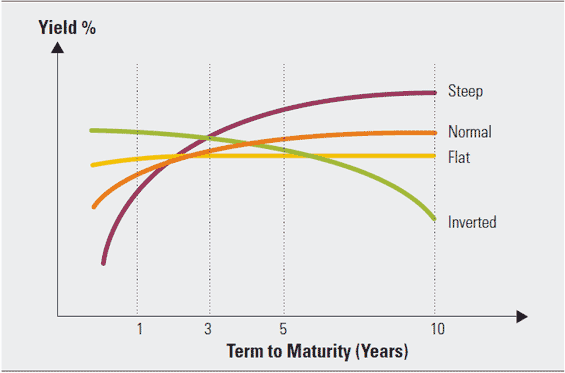

```{r global_options, include=T, echo = F}
knitr::opts_chunk$set(echo = T, warning=FALSE, message=FALSE)
```

```{r, echo=FALSE}

htmltools::img(src = knitr::image_uri(file.path("uc3m.jpg")), 
               alt = 'logo', 
               style = 'position:absolute; top:0; right:0; padding:10px;',
               width="600",
               height="80")
```

# Motivation

In this case study, we will apply factor analysis to capture the main drivers of the US economy through its interest rates

The US Government (and most of the governments in the world) pays a **yield** or **interest rate** to borrow money for different time horizons in order to raise money for investing/spending

The Treasury Department issues bonds with maturities ranging from 1 month to 30 years
(short term bonds are called T-bills whereas long term ones are called just T-bonds)

The associated yields tell us how investors feel about the economy and help determine the current and future strength of the economy

The **yield curve** joins the different bond yields (interest rates) at different maturity times. Hence, there is one yield curve for each trading day

Yield curve rates are published on the Treasury’s website each trading day. Here the last trading days: https://www.treasury.gov/resource-center/data-chart-center/interest-rates/pages/textview.aspx?data=yield

To understand better the yield curve, take a look at this 3D representation by the New York Times: https://www.nytimes.com/interactive/2015/03/19/upshot/3d-yield-curve-economic-growth.html

We expect that long-term bonds have a higher yield than shorter securities. This is what happens most of the time, but there are three main shapes of yield curve shapes: normal (upward sloping curve), inverted (downward sloping curve), and flat.

<center>




</center>

Normal curves point to economic expansion, and downward sloping (inverted) curves point to economic recession

# Load and prepare data  

```{r}
# delete everything
rm(list=ls()) 

library(tidyverse)
library(VIM)
library(Quandl)
library(VIM)
library(lubridate)
library(GGally)
library(factoextra)
library(quantmod)
```

Get US Treasury yield curves using Quandl Api

Updated data here: https://home.treasury.gov/resource-center/data-chart-center/interest-rates/TextView?type=daily_treasury_yield_curve&field_tdr_date_value=2022

```{r}
# Using Quandl
#Quandl.api_key("Your-Api-key-here")
yc <- Quandl("USTREASURY/YIELD") 

Data = yc[dim(yc)[1]:1,]
Data=rename(Data, date=Date)
date = Data$date

save(Data,file="data.RData")
# End of Quandl
```

```{r}
# In case you have problems:
load("data.RData")

head(Data)
tail(Data)
```

Analyze missing values

```{r}
aggr(Data, numbers = TRUE, sortVars = TRUE, labels = names(Data),
     cex.axis = .7, gap = 1, ylab= c('Missing data','Pattern'))
# NAs in 1-month, 2-month, 20-year, and 30-year, specially in first years
# except 2-month which is a new product and has almost complete NAs

Data = Data[,-3] # removes 2-month bill
```

The 2-month bill begins on October 16, 2018

## Descriptive analysis

To plot the evolution of each security in several panels, we need the data in tidy format

```{r}
DataTidy = gather(Data,"product", "yield", -date)
DataTidy$product <- factor(DataTidy$product, levels=unique(DataTidy$product))
head(DataTidy)
tail(DataTidy)
```

Focus on the most recent data (from year 2000):

```{r}
DataTidy = filter(DataTidy, year(DataTidy$date)>2000)
Data = filter(Data, year(Data$date)>2000)
```

Get recession periods from FRED:

```{r}
getSymbols('USREC',src='FRED')

start <- index(USREC[which(diff(USREC$USREC)==1)])
end   <- index(USREC[which(diff(USREC$USREC)==-1)-1])

rec.df <- data.frame(start=start, end=end[-1])
rec.df <- filter(rec.df, start >= min(Data$date))
# Done with recession

DataTidy %>% 
  ggplot(aes(x=date, y=yield)) + geom_point(size=1) + 
  theme_bw() + theme(legend.position="bottom") + scale_color_brewer(palette="Dark2") +
  geom_rect(data=rec.df, aes(x=NULL, y=NULL, xmin=start,xmax=end, ymin=0,ymax=6), fill="red", alpha=0.2) +
  facet_wrap(~product) + labs(title="US Treasury Yield Curve", x="", y="Yield rate (%)")

```

Some gaps (NAs), especially the 30-year bond was discontinued on February 18, 2002 and reintroduced on February 9, 2006

Short-term yields started to decrease from 2019, in 2020 the drop is very fast (coronavirus). Now they are increasing a lot!

Long-term yields decrease in the long term with noise, but after coronavirus recession they have started to increase

One outlier on 14-april-2017

Plot now the yield curve for the last dates

```{r}
last.date <- max(Data$date)

maturity = as.factor(c(0.08,0.25,0.5,1,2,3,5,7,10,20,30))
levels(DataTidy$product) = maturity

# Plot the yield curve for 8 last days:
DataTidy %>% filter(date > last.date-10) %>%
  ggplot(aes(as.numeric(as.character(product)), yield, color=factor(date))) + geom_line(size=1) + 
  theme_bw() + theme(legend.position="bottom") + scale_color_brewer(palette="Dark2") +
  labs(title=paste0("US Treasury Yield Curve: ", "last 8 days"), x="maturity", y="Yield rate (%)", col="") 

```

The curve is inverted these days

## Descriptive summary

```{r}
Data.all = Data

# take the last 440 days (roughly 2 years)
Data = slice(Data.all, (n()-440):n())
# remove possible NAs
Data = na.omit(Data) 

# Basic descriptive measures 
X = select(Data,-date)   # main object in multivariate analysis
date = Data$date

# Univariate statistics
summary(X)

# Multivariate statistics
dim(X)

# Dimension = 11. In total, 2^p different relations.


```

Plot some graphs in dimension 1

And in dimension 2

```{r}
# write here your code
```


We need ways to reduce dimensionality...

# PCA

PCA: combine the variables without loosing too much information 

The number of combinations is the number of PCs

Interest rates: from dimension 11 to dimension 3

```{r}
pca = prcomp(X)
# pca = princomp(X) # the same, but using eigen decomposition instead of SVD
pca$rotation[,1:3]
pca$sdev
summary(pca)
```

```{r}
fviz_screeplot(pca, addlabels = TRUE)

```

With 3 PCs we can explain 99% of interest-rates variation most of the variation comes from first PC

## Interpretation

```{r}
barplot(pca$rotation[,1], las = 2, col = "azure")

```

First component is easy to interpret: weighted average with expectations about long-term economic growth 

This component is referred as level: all rates will move up or down together with the level (PC1)

```{r}
barplot(pca$rotation[,1], las = 2, col = "turquoise3", main = "PC1")
grid()
```

Second component contrasts short-term rates with long-term ones 

It is referred as slope that means shorter maturity rates will move in opposite direction to the longer rates with the slope (PC2). It is usually interpreted as a term premium: long-term yield minus short-term one

```{r}
barplot(pca$rotation[,2], las = 2, col = "turquoise", main = "PC2")
```

Third component is referred as curvature it has two changes in sign: shortest and longest maturities move in the same direction whereas middle maturities move in the opposite direction (curvature)

# Factor Analysis

Analytical tool (model) to reduce the dimension, from $m$ to $r$ factors

Model with $r$ factors: for each maturity $m$, $x_{m,t} = \mu_m + L_{m}*f_{t} + a_{m,t}$

The vector with the $r$ factors is common for all the maturities and are the latent variables

Focus is now on correlations between yield rates and common factors 

Estimation of model (L and cov(a)) is based on decomposition of cov(x):
$$  \text{cov}(x) = L*L' + \text{cov}(a) $$

Factor analysis: for MLE, simply use "factanal" 

Note that MLE always scales the data.

Let's fit a 3-factor model with no rotation

```{r}
x.f <- factanal(X, factors = 3, rotation="none", scores="regression") # how many factors? 
x.f
cbind(x.f$loadings, x.f$uniquenesses)
```

var explained by first three factors is around 99%

The model explains very well the comovements between different maturities

## Interpretation

```{r}
par(mfrow=c(3,1))
barplot(x.f$loadings[,1], names=F, las=2, col="darkblue", ylim = c(-1, 1))
barplot(x.f$loadings[,2], names=F, las=2, col="darkblue", ylim = c(-1, 1))
barplot(x.f$loadings[,3], las=2, col="darkblue", ylim = c(-1, 1))

```

Now estimate the model with only two factors, rotation varimax (sparser representation), and Barlett estimation for scores (WLS)

```{r}
x.f <- factanal(X, factors = 2, rotation="varimax", scores="Bartlett", lower = 0.01)
x.f
cbind(x.f$loadings, x.f$uniquenesses)
```

var explained by the two factors is 99%

The model explains very well the comovements between different maturities

That means the different products "live" in dimension 2

```{r}
par(mfrow=c(2,1))
barplot(x.f$loadings[,1], names=F, las=2, col="darkblue", ylim = c(-1, 1))
barplot(x.f$loadings[,2], las=2, col="darkblue", ylim = c(-1, 1))

```

The factors can be interpreted as two different levels: one with more weights to short-term maturities, and the other one with more weights to long-term maturities

## Scores

```{r}
factor.df = data.frame(date=date, x.f$scores) %>% gather("factor", "score", -date)

factor.df %>%
  ggplot(aes(x=date,y=score)) + geom_line(size=1) + 
    scale_x_date(breaks = scales::date_breaks("2 month")) +
  theme_bw() + theme(legend.position="bottom") + scale_color_brewer(palette="Dark2") +
  facet_wrap(~factor, ncol=1) +
  labs(title="2-factor model", x="", y="scores", col="") 

```

Can we forecast the interest rates for the next days?

If we are able to forecast the 2 factors, then we can forecast the yield curve using the factor model:
$$   \text{rate}_t = \mu + L*f_t + a_t $$